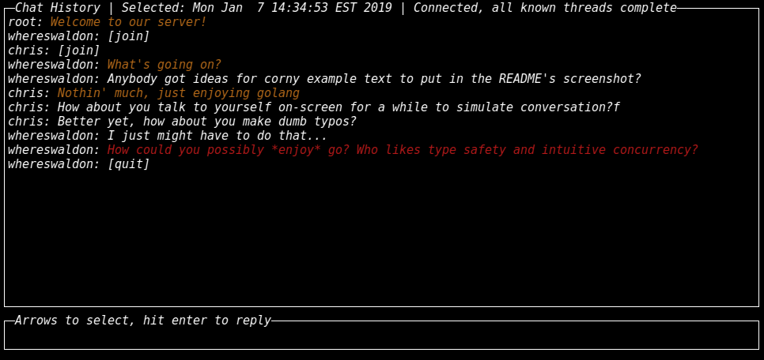

# Muscadine

Muscadine is the reference client for the [Arbor chat protocol](https://github.com/arborchat/protocol).

**DISCLAIMER**: Arbor currently doesn't use any encryption whatsoever. We are working to change that, but
right now anything sent over the system can be recorded or modified by malicious third parties. DO NOT
send anything sensitive over Arbor, and DO NOT put a great deal of faith in the integrity of messages
that you recieve from others.

It currently runs as a terminal user interface that looks something like this:



In this screenshot, you can see that one message (highlighted in red) is selected. The user can hit "enter"
to reply to this message, or can use up/down arrow keys to scroll. Importantly, the selected message isn't
actually a direct reply to the message above it. The messages highlighted in yellow are the series of replies
relevant to the selected message.

This is muscadine's (and arbor's) killer feature. You can actually see the context for new messages that come
in. If someone replies to a much earlier message, you can tell that they are doing so. This is a marked improvement
over the current clutter that can build up during group chat sessions.

You may also notice the `[join]` and `[quit]` messages. Since Arbor does not track online users, Muscadine sends these
messages to inform the chat of who is connected.

The very first line in the screenshot contains some extra information about the current session:

- Shown in the screenshot
    - `Selected: Mon Jan 7 14:34:53 EST 2019`: shows the timestamp of the selected message (the red line in the screenshot)
    - `Connected`: indicates Muscadine is connected to an Arbor server
    - `all known threads complete`: indicates the entire chat history is loaded by the client
- Not shown in the screenshot
    - `Connecting...`: indicates Muscadine is trying to connect to an Arbor server
    - `3+ broken threads, q to query`: The `3` indicates how many messages are missing their history. `q to query` is a
    reminder to press q in order to ask the server for missing information. This key usually has no effect since Muscadine
    automatically queries missing history on startup.

## What's a Muscadine?

Muscadine is named after [muscadine grapes](https://en.wikipedia.org/wiki/Vitis_rotundifolia), a wild grape native to the
southeastern United States. This name was chosen because the initial developers live in the southeastern US, and because
these grape vines are a climbing plant that is often supported by an arbor.

## Install

The best way to install Muscadine is to head over to our [Releases](https://github.com/arborchat/muscadine/releases) page and pick up the latest build for your operating system.

## Build

If you'd like to build Muscadine, make sure you have [Go](https://golang.org/) and [dep](https://github.com/golang/dep) installed. Clone this repository, then run:

```
cd muscadine
./build.sh
```

## Use

To join a server, run:

```
~/go/bin/muscadine -username $USER <IP:Port>
```

The keybindings are:

- History Mode
    - up/down/j/k - scroll the selected message up and down
    - left/right/h/l - scroll the viewport (not the cursor) up and down
    - enter/i/r - start a reply to the selected message
    - n - reply to the earliest known message (the root message)
    - home/g - jump to top of history
    - end/G - jump to bottom of history
    - q - query the server for any missing chat history (only necessary if top status bar indicates)
- Compose Mode:
    - enter - send your message (unless in paste mode)
    - ctrl+p - toggle "paste mode", in which the enter key will *not* send the message, but instead type a newline
    - escape - return to history mode
- Global:
    - ctrl+c - quit

